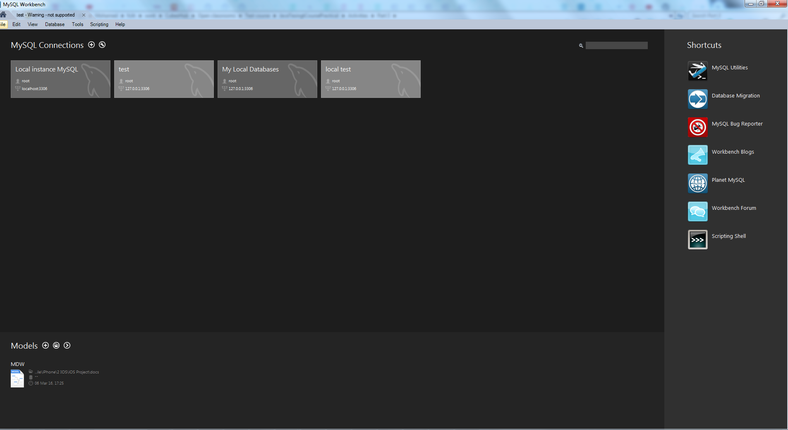
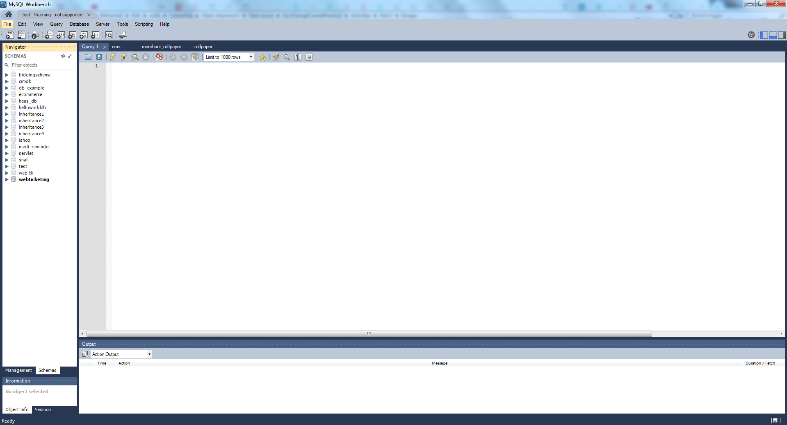
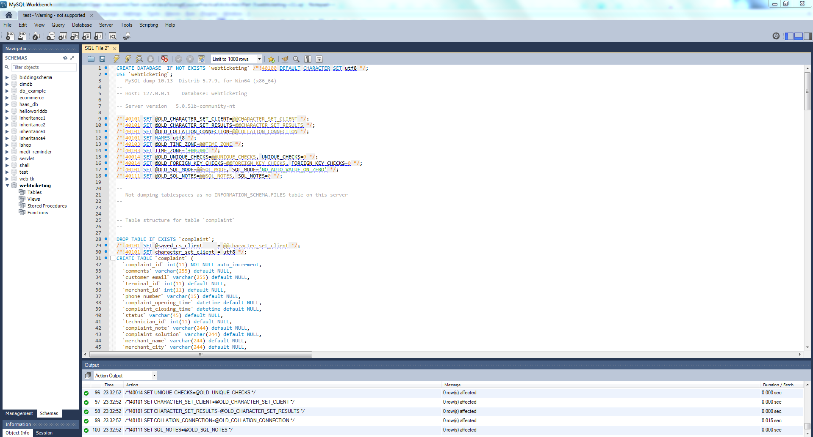
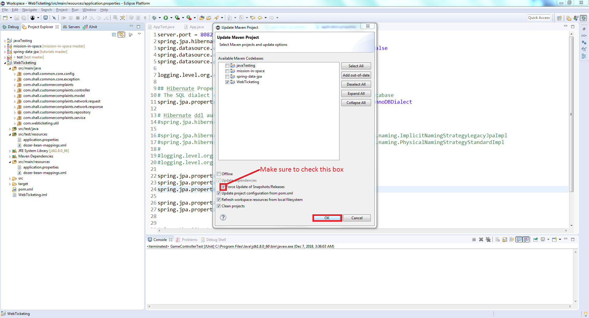
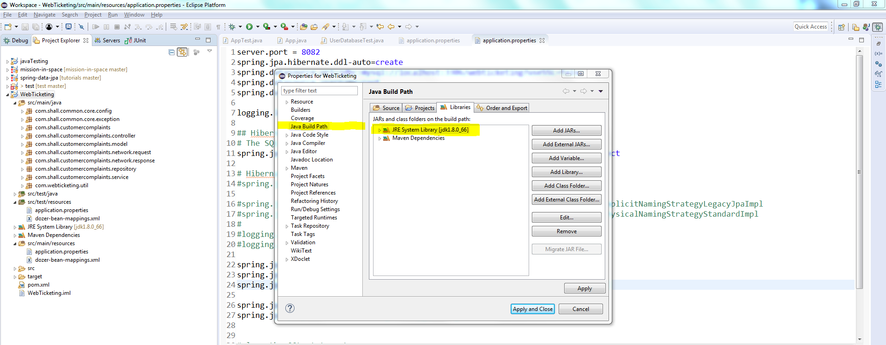

# Activity guide

## Project setup:

1. Download MySQL workbench from the following location: [MySQL-Workbench source](https://www.mysql.com/products/workbench/)
During the setup please make sure to set the username=**root** & password=**root**

2. After the setup open the file using notepad: **webticketing-v11.sql**. You'll find it in the Database directory.

3. Now launch **MySQL Workbench**
4. You will find the home screen as in the below image
5. 
		
6. Now open the My SQL Local instance
7. You find the screen after loading like this
8. 
		

9. Now copy the content of **webticketing-v11.sql** file from notepad
10. Paste it there as in the below screenshot
11. 
	

12.	In Unsolved directory, you find the project **WebTicketing**, import it in eclipse as a maven project.
13.	After importing the project, right click :arrow_right: Maven :arrow_right: Update maven project

14. Make sure to check the checkbox of force update as in the below screenshot

16. After this, we need to make sure that the project java version is set to the JDK, so right click on the project :arrow_right: Properties :arrow_right: Build path :arrow_right: Make sure that the java version there is JDK

17. From the toolbar :arrow_right: select project :arrow_right: clean 

18. Now, right click on the project :arrow_right: Run as :arrow_right: Maven clean

19. Now, right click on the project :arrow_right: Run as :arrow_right: Maven install

20. Wait until you see the project build as **Build Success**

-------------------------

## Activity Instructions:

1. Navigate to the **UserRestTest** under test package 
	 > com.shall.customercomplaints.integration.network

2. Un-comment the class comments through `CTRL` + `/` or if you're using MAC then `cmd` + `/` Then click save

3. Navigate to the **UserDatabaseTest** under test package 
	 > com.shall.customercomplaints.repository

4. Un-comment the class comments through `CTRL` + `/` or if you're using Mac then `cmd` + `/` Then click save

5. Now you can see these test classes we went through the course. Its your turn now to test the following two classes with the same approach
6. First class is: **Complaint controller**. You will find it under the following package
	> com.shall.customercomplaints.controller
7. Second class is: **ComplaintsRepository**. You will find it under the following package
	> com.shall.customercomplaints.repository

- You should apply the best practices we took across the course, starting from the class name, method names, test fixtures ...etc. 
- There will be peer reviews, which means your colleague will review your work and both will judge each other. 
- I left this open without putting what should be added or not as this would motivate you much to follow the best practices and if you apply them then you shall not receive any review comments :)

- Eventually, enjoy :) 

